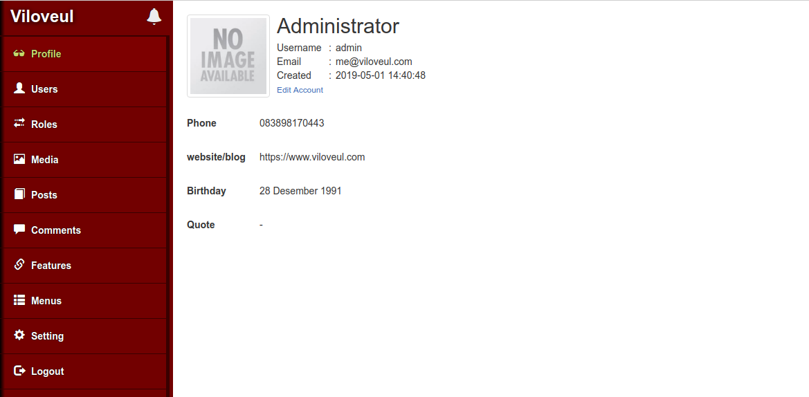

# Viloveul CMS (Dashboard UI Management)



clone this repository
```bash
git clone https://github.com/viloveul/cms-dashboard.git
```
lakukan proses instalasi
```bash
cd cms-dashboard
npm install
```
buat file bernama .env di root folder yang berisi minimal:
```bash
VILOVEUL_API_URL=http://your-viloveul-cms-api
```
jalankan:
```bash
npm run dev
## buka http://localhost:19912